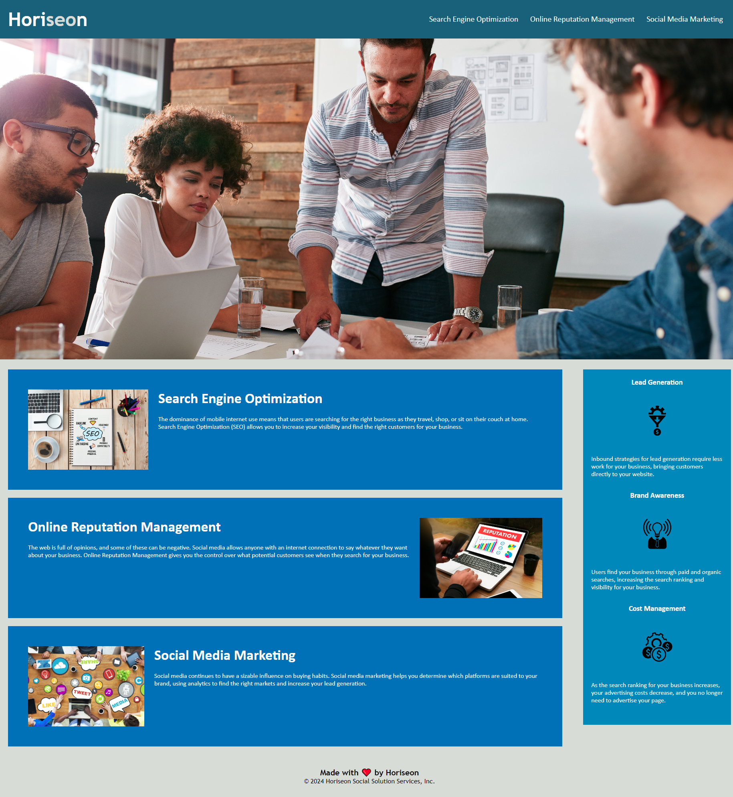

# Horiseon Homepage

- [Further Changes](#further-changes)
- [Key Learnings](#key-learnings)
- [Contributing and Feedback](#contributing-and-feedback)
- [Credits](#credits)
- [License](#license)

## The Homepage - Starter Code Optimisation

This homepage was provided with starter code which was edited to improve performance in a number of key areas without affecting the appearance.
The role of this page is to provide an attractive accesible platform from which to navigate to other areas on the website. (Note links to external pages presently do not exist)

The main goal of the project was to optimise for search engines by:
- Adding semantic elements.
- Improving the structure of html elements.
- Adding a descriptive title.

## Further Changes
Other alterations include:
- Writing a README.
- Fixing a non functioning link.
- Tidying and condensing the stylesheet.
- Adding alt descriptions to images.

## Key Learnings

There were a number of skills I had the opportunity to learn and practice. 
The biggest learning time wise for me was that you can't add an alt to an image added through the stylesheet as it doesn't appear on the html.
Some potential work arounds can include adding a hidden html image in place with an alt description or the use of an aria-label.
Other learnings include:
- Definition and application of semantic elements.
- Commenting practices on both html and css.
- Improving flow and structure of selectors in css.
- The use of markdown and writing a readme.

## Contributing and Feedback

If you find any issues or have contributions or feedback you can do so by opening an [issue](https://github.com/Jiske-N/challenge-1/issues) on Github.

## Credits

Original starter code written by Horiseon
Starter code provided by edX

## License

© 2024 Horiseon Social Solution Services, Inc.
Presently unsure of the license if any.